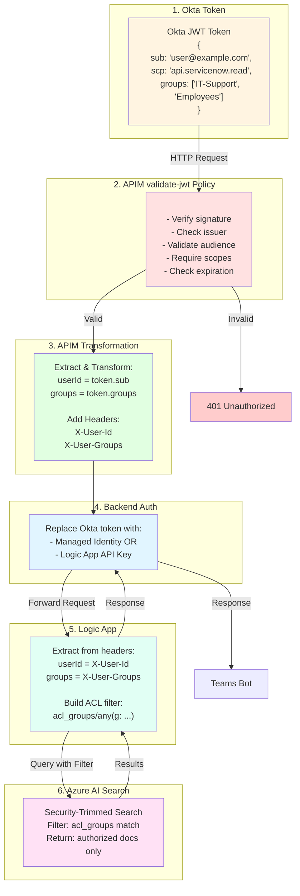

## Authentication Flow Overview

> **Two Architecture Options**: This document presents both federation approaches
>
> - **Option 1**: Direct Okta → Entra ID → Teams SSO (shown in main diagram)
> - **Option 2**: Okta → APIM Gateway → Logic App (shown in alternative diagram)

### Option 1: Direct Entra ID Federation Flow

The following diagram illustrates the complete authentication and authorization flow with Entra ID federation:


### Token & ACL Flow


---

### Option 2: API Management Gateway Flow

Alternative architecture using Azure API Management as OAuth middleware:

```mermaid
sequenceDiagram
    autonumber
    actor User as User (Teams)
    participant Teams as Teams Bot<br/>(A2A Client)
    participant Okta as Okta OAuth<br/>(Authorization Server)
    participant APIM as Azure APIM<br/>(Gateway + JWT Validator)
    participant LA as Logic App<br/>(Agent Loop)
    participant AIMS as Azure AI Search<br/>(ServiceNow Index)
    participant OpenAI as Azure OpenAI

    Note over User,OpenAI: Alternative: APIM as OAuth Gateway

    rect rgb(240, 248, 255)
        Note over User,Okta: Phase 1: Okta OAuth Authentication
        User->>Teams: Open ServiceNow Agent
        Teams->>Teams: Check cached Okta token
        alt No valid token
            Teams->>Okta: Redirect to authorization endpoint<br/>(/oauth2/default/v1/authorize)
            Okta->>User: Present login page
            User->>Okta: Enter credentials
            Okta->>Okta: Validate credentials
            Okta->>Okta: Retrieve user groups
            Okta->>Teams: Authorization code (redirect)
            Teams->>Okta: Exchange code for token<br/>(/oauth2/default/v1/token)
            Okta-->>Teams: Access token (JWT) with groups claim
            Teams->>Teams: Cache token
        end
    end

    rect rgb(255, 250, 240)
        Note over Teams,APIM: Phase 2: A2A Discovery via APIM
        Teams->>APIM: GET /.well-known/agent-card.json<br/>Authorization: Bearer {okta-token}
        APIM->>APIM: Validate JWT (validate-jwt policy)
        APIM->>LA: Forward request (managed identity)
        LA-->>APIM: Agent card
        APIM-->>Teams: Agent card: {name, endpoints, capabilities}
    end

    rect rgb(240, 255, 240)
        Note over User,APIM: Phase 3: User Query via A2A + APIM
        User->>Teams: "How do I reset my password?"
        Teams->>Teams: Build A2A message payload
        Teams->>APIM: POST /message/send<br/>Authorization: Bearer {okta-token}
        
        Note over APIM: APIM JWT Validation & Transformation
        APIM->>Okta: Validate JWT against OpenID config
        Okta-->>APIM: Token valid + metadata
        APIM->>APIM: Extract claims:<br/>- User ID (sub)<br/>- Groups (from token)
        APIM->>APIM: Apply policies:<br/>- Rate limiting<br/>- Request transformation
        APIM->>APIM: Add custom headers:<br/>X-User-Id, X-User-Groups
        APIM->>APIM: Remove Okta token,<br/>add managed identity
        
        APIM->>LA: Forward to Logic App<br/>X-User-Id, X-User-Groups headers
        LA-->>APIM: Return {taskId, status: "running"}
        APIM-->>Teams: Return {taskId, status: "running"}
    end

    rect rgb(255, 240, 245)
        Note over LA,OpenAI: Phase 4: Agent Loop Execution
        LA->>LA: Extract groups from X-User-Groups header
        LA->>LA: Build ACL filter:<br/>acl_groups/any(g: g eq 'group1' OR g eq 'group2')
        
        LA->>AIMS: Search with filter<br/>Authorization: Managed Identity
        AIMS->>AIMS: Execute security-trimmed search
        AIMS-->>LA: Filtered results (only authorized docs)
        
        LA->>OpenAI: Generate response<br/>Authorization: Managed Identity
        OpenAI-->>LA: Generated answer
    end

    rect rgb(245, 245, 245)
        Note over APIM,User: Phase 5: A2A Response via APIM
        Teams->>APIM: POST /tasks/get<br/>Authorization: Bearer {okta-token}
        APIM->>APIM: Validate JWT
        APIM->>LA: Forward request
        LA-->>APIM: {status: "succeeded", message: {...}}
        APIM-->>Teams: {status: "succeeded", message: {...}}
        Teams-->>User: Display answer with citations
    end

    rect rgb(255, 245, 238)
        Note over User,AIMS: Security Enforcement Points
        Note right of Okta: ✓ OAuth token with groups claim
        Note right of APIM: ✓ JWT validation (signature + claims)<br/>✓ Rate limiting & policies
        Note right of APIM: ✓ Groups extracted and passed via headers
        Note right of LA: ✓ Groups from headers used for ACL
        Note right of AIMS: ✓ Search filtered by ACL groups
    end
```



### APIM Policy Enforcement Flow



### Architecture Comparison

| Aspect | Option 1: Entra Federation | Option 2: APIM Gateway |
|--------|---------------------------|------------------------|
| **Token Issuer** | Entra ID (via Okta SAML) | Okta OAuth (direct) |
| **Teams Auth** | Native SSO (`getAuthToken()`) | Custom OAuth connection |
| **Validation Layer** | Logic App EasyAuth | APIM validate-jwt policy |
| **Group Claims** | JWT from Entra | JWT from Okta + APIM extraction |
| **Backend Auth** | EasyAuth + Managed Identity | APIM Managed Identity or API Key |
| **Components** | 3 (Okta, Entra, Logic App) | 4 (Okta, APIM, Logic App, AI Search) |
| **Complexity** | Medium | High |
| **Latency** | Lower | Higher (~10-50ms APIM overhead) |
| **Cost** | Lower | Higher (APIM costs) |
| **Flexibility** | Microsoft-centric | Multi-cloud, any OAuth provider |
| **Monitoring** | App Insights | APIM Analytics + App Insights |
| **Rate Limiting** | App-level | Centralized at APIM |

---

### A2A Protocol Endpoints

**📚 [A2A Protocol v1 Specification](https://a2a-protocol.org/latest/specification/) | [Method Mapping Reference (Section 3.5.6)](https://a2a-protocol.org/latest/specification/#356-method-mapping-reference-table) | [Teams A2A Library](https://learn.microsoft.com/en-us/microsoftteams/platform/teams-ai-library/typescript/in-depth-guides/ai/a2a/overview)**

Your Logic App exposes these standard A2A v1 (JSON-RPC 2.0) endpoints:

| JSON-RPC Method | gRPC Method | REST Endpoint | Purpose | Request Example |
|-----------------|-------------|---------------|---------|-----------------|
| N/A | N/A | `GET /.well-known/agent-card.json` | Agent discovery - returns metadata about capabilities, auth, skills | N/A (GET request) |
| `message/send` | `SendMessage` | `POST /v1/message:send` | Send message to create/continue task (synchronous/polling) | `{"jsonrpc":"2.0","id":1,"method":"message/send","params":{"message":{"role":"user","parts":[{"kind":"text","text":"hello"}]}}}` |
| `message/stream` | `SendStreamingMessage` | `POST /v1/message:stream` | Send message with real-time SSE streaming updates | `{"jsonrpc":"2.0","id":2,"method":"message/stream","params":{"message":{"role":"user","parts":[{"kind":"text","text":"hello"}]}}}` |
| `tasks/get` | `GetTask` | `GET /v1/tasks/{id}` | Retrieve task status and results (for polling) | `{"jsonrpc":"2.0","id":3,"method":"tasks/get","params":{"id":"task-123"}}` |
| `tasks/cancel` | `CancelTask` | `POST /v1/tasks/{id}:cancel` | Cancel an ongoing task | `{"jsonrpc":"2.0","id":4,"method":"tasks/cancel","params":{"id":"task-123"}}` |

**Example Agent Card** (returned from `/.well-known/agent-card.json`):

```json
{
  "protocolVersion": "0.3.0",
  "name": "ServiceNow Knowledge Agent",
  "description": "Security-trimmed access to ServiceNow articles via Okta/Entra federation",
  "url": "https://<your-logic-app>.azurewebsites.net/api/a2a",
  "preferredTransport": "JSONRPC",
  "capabilities": {
    "streaming": true,
    "pushNotifications": false
  },
  "securitySchemes": {
    "entraIdJwt": {
      "type": "http",
      "scheme": "bearer",
      "bearerFormat": "JWT"
    }
  },
  "security": [{"entraIdJwt": []}],
  "defaultInputModes": ["text/plain"],
  "defaultOutputModes": ["text/plain"],
  "skills": [
    {
      "id": "search-knowledge",
      "name": "Search Knowledge Articles",
      "description": "Searches ServiceNow knowledge base with security trimming",
      "tags": ["search", "knowledge", "servicenow"]
    }
  ]
}
```

**Example Request** (`POST /message/send`):
```json
{
  "jsonrpc": "2.0",
  "method": "message/send",
  "params": {
    "messageId": "msg-123",
    "role": "user",
    "parts": [{
      "type": "text",
      "text": "How do I reset my password?"
    }]
  }
}
```

### ACL Mapping Flow (Okta → Azure AI Search)

**🎯 This is the critical security enforcement mechanism:**

```mermaid
graph TD
    subgraph "1. Okta Groups"
        OG["Okta User Groups<br/>• IT-Support<br/>• Employees<br/>• Finance-Team"]
    end
    
    subgraph "2. Entra ID Federation"
        EG["SAML Group Mapping<br/>Okta Group ID → Entra Object ID<br/>• 00u1234... → abc-def-123...<br/>• 00u5678... → xyz-uvw-456..."]
    end
    
    subgraph "3. Teams SSO Token"
        JWT["JWT Claims<br/>{<br/>  sub: 'user@example.com',<br/>  groups: ['abc-def-123', 'xyz-uvw-456']<br/>}"]
    end
    
    subgraph "4. Azure AI Search Index"
        IDX["ServiceNow Documents<br/>Document 1:<br/>  title: 'Password Reset'<br/>  content: '...'<br/>  acl_groups: ['abc-def-123', 'ghi-jkl-789']<br/><br/>Document 2:<br/>  title: 'Payroll Guide'<br/>  content: '...'<br/>  acl_groups: ['xyz-uvw-456']"]
    end
    
    subgraph "5. OData Filter"
        FLT["acl_groups/any(g:<br/>  g eq 'abc-def-123' OR<br/>  g eq 'xyz-uvw-456'<br/>)"]
    end
    
    OG -->|"SAML Federation"| EG
    EG -->|"Token Issuance"| JWT
    JWT -->|"Extract groups claim"| FLT
    FLT -->|"Filter query"| IDX
    IDX -->|"✅ Doc 1 & 2 match<br/>❌ Other docs excluded"| Results["Security-Trimmed Results"]
    
    style OG fill:#fff4e1
    style EG fill:#e1ffe1
    style JWT fill:#e1f5ff
    style IDX fill:#e1fff4
    style FLT fill:#ffe1e1
    style Results fill:#d4edda
```



**Key Implementation Details:**

1. **Index Schema** - Your Azure AI Search index MUST have:
   ```json
   {
     "name": "acl_groups",
     "type": "Collection(Edm.String)",
     "filterable": true,
     "retrievable": false
   }
   ```

2. **Document Ingestion** - Each ServiceNow document indexed with Okta/Entra group IDs:
   ```json
   {
     "id": "KB0001",
     "title": "Password Reset Procedure",
     "content": "To reset your password...",
     "acl_groups": ["abc-def-123", "ghi-jkl-789"]
   }
   ```

3. **Logic App Workflow** - Extract groups from JWT and build OData filter:
   ```javascript
   // Extract from JWT claims
   const userGroups = context.request.headers.authorization.claims.groups;
   
   // Build OData filter
   const filter = `acl_groups/any(g: ${userGroups.map(g => `g eq '${g}'`).join(' or ')})`;
   // Result: "acl_groups/any(g: g eq 'abc-def-123' or g eq 'xyz-uvw-456')"
   
   // Query AI Search with filter
   const searchResults = await aiSearch.search(query, { filter });
   ```

4. **Query Execution** - Azure AI Search applies filter:
   ```http
   POST https://<search-service>.search.windows.net/indexes/servicenow/docs/search
   {
     "search": "password reset",
     "filter": "acl_groups/any(g: g eq 'abc-def-123' or g eq 'xyz-uvw-456')",
     "top": 10
   }
   ```

**📚 References:**
- [Azure AI Search Security Trimming](https://learn.microsoft.com/en-us/azure/search/search-security-trimming-for-azure-search)
- [OData Filter Syntax](https://learn.microsoft.com/en-us/azure/search/query-odata-filter-orderby-syntax)
- [Document-Level Access Control](https://learn.microsoft.com/en-us/azure/search/search-document-level-access-overview)

---
