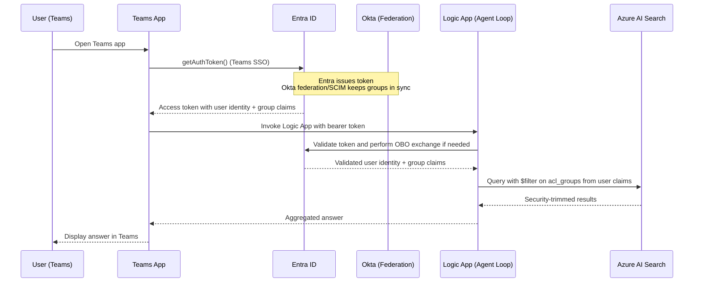

# Teams + Logic App + Azure AI Search (ServiceNow Index) PoC

## Objective
Prototype a secure Teams agent loop that queries a ServiceNow-backed Azure AI Search index.  
User access is restricted via **Okta federation** so each user only sees data they are authorized to view.

> **🎯 Two Federation Approaches Available:**
> 
> - **Option 1:** Okta → Entra ID (SAML) → Teams SSO → Logic App
> - **Option 2:** Okta OAuth → Teams Bot → APIM Gateway → Logic App
>
> **See [Architecture Decision Guide](./README_ARCHITECTURE_DECISION.md) to choose the right approach for your needs.**

### Assumptions & Prerequisites
- **Option 1:** Microsoft Entra ID has direct federation or SCIM provisioning from Okta so group claims surface in Teams SSO tokens.
- **Option 2:** Azure API Management deployed to validate Okta JWT tokens and enforce policies.
- ServiceNow export/ETL process (Logic App, Data Factory, or custom pipeline) keeps knowledge articles and ACL metadata current in Azure AI Search.
- Logic App and Azure AI Search resources are deployed with managed identities and required RBAC permissions in the same tenant.

---

## System Overview

> **Note:** This section describes **Option 1 (Direct Entra Federation)**. For **Option 2 (APIM Gateway)**, see the [Architecture Decision Guide](./README_ARCHITECTURE_DECISION.md) and [Identity Federation Flow](./README_IDENTITY_FEDERATION_FLOW.md#option-2-api-management-gateway-flow).

### Core Components (Option 1)
| Layer | Role |
|-------|------|
| **Teams App / Bot** | Front-end for user queries (Teams SSO token issuance). |
| **Microsoft Entra ID** | Issues access tokens; supports OBO (On-Behalf-Of) flow. |
| **Okta** | Identity provider federated with Entra via SAML. |
| **Logic App (Agent Loop)** | Executes orchestrated retrieval, handles token validation and OBO exchange, calls Azure AI Search. |
| **Azure AI Search (ServiceNow Index)** | Stores indexed ServiceNow data with ACL metadata. |

### Core Components (Option 2)
| Layer | Role |
|-------|------|
| **Teams Bot** | Front-end for user queries with custom OAuth connection. |
| **Okta OAuth Server** | Issues JWT tokens with group claims. |
| **Azure API Management** | Validates Okta tokens, enforces policies, extracts claims. |
| **Logic App (Agent Loop)** | Executes orchestrated retrieval using headers from APIM. |
| **Azure AI Search (ServiceNow Index)** | Stores indexed ServiceNow data with ACL metadata. |

---

## High-Level Flow (Option 1: Entra Federation)



Entra remains the token issuer for Teams SSO; Okta integration only supplies identity attributes and group memberships that Entra includes in the downstream access tokens.

**For Option 2 (APIM Gateway) flow diagram, see:** [README_IDENTITY_FEDERATION_FLOW.md - Option 2](./README_IDENTITY_FEDERATION_FLOW.md#option-2-api-management-gateway-flow)

## Agent Loop Integration (A2A)

The Logic App follows the Logic Apps Labs guidance for [building conversational agents](https://azure.github.io/logicapps-labs/docs/category/build-conversational-agents/) and the dedicated module on [connecting agents with the A2A protocol](https://azure.github.io/logicapps-labs/docs/logicapps-ai-course/build_conversational_agents/connect-agents-a2a-protocol). The Teams bot never calls Azure OpenAI (or any downstream skill) directly; it acts as an A2A client that invokes the Logic App agent endpoint, which then orchestrates Azure AI Search, Azure OpenAI, and any other tools configured in the loop.

### Agent discovery
- Fetch the agent card from `{AGENT_URL}/.well-known/agent-card.json` using the `X-API-Key` header (or EasyAuth bearer token when enforced). The card advertises the agent name, description, supported skills, authentication requirements, and transport capabilities (polling vs streaming).
- Cache the card in the Teams bot for reuse, but revalidate on startup or when the Teams app receives a `401/403` to detect rotation or capability changes.

```json
{
  "name": "ServiceNow Support Agent",
  "description": "Routes ServiceNow queries to Azure AI Search and fulfillment tools",
  "a2a": {
    "endpoints": {
      "message/send": "https://<logic-app-host>/message/send",
      "tasks/get": "https://<logic-app-host>/tasks/get",
      "message/stream": "https://<logic-app-host>/message/stream"
    }
  }
}
```

### A2A messaging contract

| Step | Endpoint | Payload highlights |
|------|----------|--------------------|
| **Send message** | `POST {AGENT_URL}/message/send` | JSON-RPC 2.0 envelope with `id`, `method`, and `params.message`. Include Teams context inside the message payload (`parts[].text`, optional `parts[].json`) so the Logic App can map the user to Okta/Entra groups. |
| **Poll (non-streaming)** | `POST {AGENT_URL}/tasks/get` | Provide the `taskId` returned from `message/send`. Poll until `status.state` becomes `succeeded`, `failed`, or `auth-required`. |
| **Stream (preferred)** | `GET {AGENT_URL}/message/stream?taskId=...` | Subscribe via Server-Sent Events (SSE) to receive incremental `message` and `status` events until completion. Useful for progressive responses in Teams. |

Example `message/send` body:

```json
{
  "jsonrpc": "2.0",
  "id": "${uuid}",
  "method": "message/send",
  "params": {
    "message": {
      "messageId": "${uuid}",
      "role": "user",
      "parts": [
        {
          "kind": "text",
          "text": "How do I reset my ServiceNow password?"
        },
        {
          "kind": "json",
          "json": {
            "teamsUserId": "{activity.from.id}",
            "tenantId": "{activity.channelData.tenant.id}",
            "conversationId": "{activity.conversation.id}",
            "groups": ["Okta-IT-ServiceDesk", "Okta-Employees"],
            "timestamp": "2025-01-03T19:05:22.124Z"
          }
        }
      ]
    }
  }
}
```

When the Logic App finishes, the `tasks/get` response mirrors the A2A schema. The Teams bot renders the latest `agent` message `parts[].text` and can surface `artifacts` (for citations or follow-up actions) as adaptive cards.

### Authentication expectations
- Default: include `X-API-Key: {AGENT_API_KEY}` on every A2A request.
- EasyAuth (if configured on the logic app): send the Teams SSO bearer token; EasyAuth validates OBO and injects identity headers. In this mode, ignore the API key unless the agent explicitly requires dual auth.
- For hybrid scenarios, first attempt EasyAuth with Teams SSO; on `401`, retry with the API key to support both modes during migration.

### Logic App implementation checklist (A2A)
- Use the Logic Apps Labs agent loop template to scaffold the workflow (HTTP trigger → agent loop orchestration → tool calls → response) and enable the built-in A2A trigger.
- Validate the incoming Teams SSO token (via EasyAuth or manual validation activity) and perform On-Behalf-Of (OBO) exchange when Graph or other Entra-protected APIs are invoked.
- Map `user_context.groups` (from the message payload or EasyAuth headers) to the Azure AI Search filter so only authorized ServiceNow hits are returned to Azure OpenAI.
- Normalize the Logic App result to the A2A task schema; populate both streaming and polling responses so Teams can handle either transport.
- Emit Application Insights telemetry (`traceId`, `policy`, `tool_calls`, `taskId`) to correlate Teams conversations with agent loop executions.

---

## Task Breakdown

### 1. Identity & Auth Setup
- Federate Okta → Entra ID (SAML/OIDC).
- Enable Teams SSO in app manifest (getAuthToken).
- Register API + Logic App in Entra; configure OBO flow.
- Assign user.read + custom API scopes.
- Issue a Logic App agent API key and/or configure EasyAuth so the A2A client can authenticate with either `X-API-Key` or bearer tokens.

### 2. ServiceNow Data Ingestion
- Use Azure Data Factory, Logic Apps, or Functions to export ServiceNow knowledge articles and ACL metadata into the Azure AI Search index.
- Map ServiceNow groups/roles to `acl_groups` values that align with Okta/Entra group names.
- Schedule incremental refresh and reconcile deletes/retirements so `is_deleted` stays accurate.

### 3. Logic App Agent Loop
- Start from the Logic Apps Labs agent loop template and customize the toolchain (Azure AI Search + Azure OpenAI) for ServiceNow knowledge.
- Add an Entra-protected HTTP trigger and configure JWT validation middleware to accept Teams SSO tokens.
- Parse the incoming JWT to extract group claims and validate the token signature against Entra ID.
- Optionally perform OBO token exchange if the Logic App needs to call other Microsoft Graph APIs or services.
- Build Azure Search `$filter` expressions from the extracted group claims:

```
acl_groups/any(g: g eq 'group1' or g eq 'group2') and is_deleted ne true
```

- When the group list is dynamic, join claims into a comma-separated string and use `search.in(acl_groups, '<group1,group2>', ',')` from the server-side SDK.
- Query Azure AI Search using the Logic App managed identity, invoke Azure OpenAI with the filtered documents, and include correlation metadata in the final response payload.
- Return trimmed results (or deny) if no authorized groups remain after filtering.
- Surface responses through the A2A task schema (`message/send`, `tasks/get`, `message/stream`) so clients receive consistent status, artifacts, and agent messages.

### 4. Azure AI Search
- Include `acl_groups` field as `Collection(Edm.String)` (filterable/facetable) and enable semantic ranking if needed.
- Assign the Logic App managed identity the `Search Index Data Reader` role via Azure RBAC.
- Apply incremental push/indexing from the ServiceNow pipeline and validate `$filter` queries manually for ACL trimming.

### 5. Okta Federation & Teams Integration
- Configure direct federation or OIDC trust between Okta and Entra ID so Teams SSO tokens surface Okta groups.
- Enable SCIM/HR-driven provisioning to keep group membership aligned across Okta and Entra.
- (Optional) Leverage Okta Workflows Microsoft Teams connector ([Okta Docs](https://help.okta.com/wf/en-us/Content/Topics/Workflows/connector-reference/microsoft-teams/microsoft-teams.htm)) for automation beyond the core loop.

### 6. Security and Governance
- Configure the Logic App HTTP trigger with Entra OAuth authentication to validate incoming Teams SSO tokens.
- Implement JWT signature validation and token expiration checks within the Logic App.
- Deny-by-default if no group intersection exists, and return auditable `403` responses.
- Enable Application Insights/OpenTelemetry for the Logic App to capture token validation and search telemetry.
- Consider rate limiting and request throttling at the Logic App level to prevent abuse.

---

## Validation Steps
1. Log in to Teams → get SSO token.
2. Fetch `{AGENT_URL}/.well-known/agent-card.json` using the Teams credentials (API key or EasyAuth) and confirm the advertised endpoints and skills match expectations.
3. Invoke `message/send` with the Teams SSO context embedded in the message payload and ensure the Logic App validates the token, orchestrates the agent loop (Azure AI Search + Azure OpenAI), and returns a `taskId`.
4. Poll `tasks/get` (or subscribe to `message/stream`) until completion; confirm search results limited to ACL matches and that unauthorized groups receive `403` or `auth-required` states.
5. Test with different users / Okta groups.

---

## Next Steps
- Add Application Insights + OTel for tracing.
- Automate ServiceNow data refresh (Functions + Push API).
- Add AAD group ↔ ServiceNow role mapping table.
- Extend to multi-tenant Foundry agent orchestration later.

## References
- [Logic Apps Labs: Build Conversational Agents](https://azure.github.io/logicapps-labs/docs/category/build-conversational-agents/)
- [Logic Apps Labs: Connect Agents with the A2A Protocol](https://azure.github.io/logicapps-labs/docs/logicapps-ai-course/build_conversational_agents/connect-agents-a2a-protocol)
- [Latest A2A Protocol Specification](https://a2a-protocol.org/latest/specification/)
- [Microsoft Teams SSO with getAuthToken](https://learn.microsoft.com/en-us/microsoftteams/platform/tabs/how-to/authentication/tab-sso-overview)
- [OAuth 2.0 On-Behalf-Of flow in Entra ID](https://learn.microsoft.com/en-us/entra/identity-platform/v2-oauth2-on-behalf-of-flow)
- [Logic Apps authentication and managed identities](https://learn.microsoft.com/en-us/azure/logic-apps/authenticate-with-managed-identity)
- [Secure backends with Azure API Management and Entra ID](https://learn.microsoft.com/en-us/azure/api-management/api-management-howto-protect-backend-with-aad)
- [Azure AI Search security trimming patterns](https://learn.microsoft.com/en-us/azure/search/search-security-trimming-for-azure-search)
- [Azure AI Search OData functions (`search.in`, `any`)](https://learn.microsoft.com/en-us/azure/search/search-query-odata-search-in-function)
- [Configure Okta federation with Entra ID](https://learn.microsoft.com/en-us/entra/external-id/direct-federation)
- [ServiceNow connectors for Azure integration](https://learn.microsoft.com/en-us/connectors/service-now/)

---

## Outcome
Teams users query ServiceNow knowledge securely via the Logic App agent loop, with the Logic App directly handling token validation and dynamic ACL enforcement based on Okta/Entra identity. 
